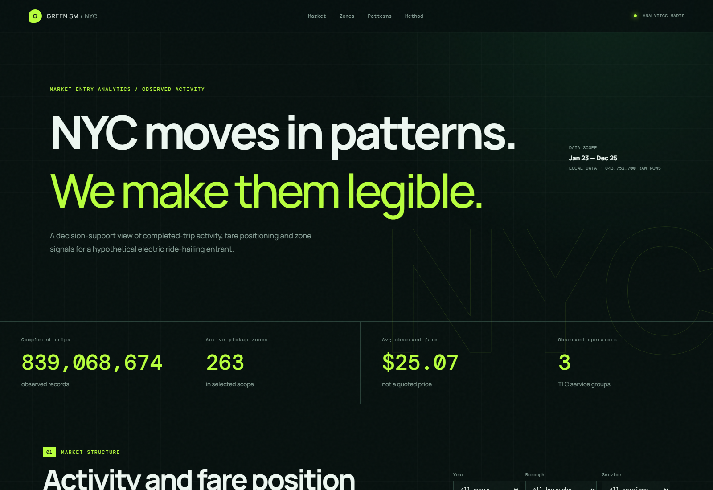
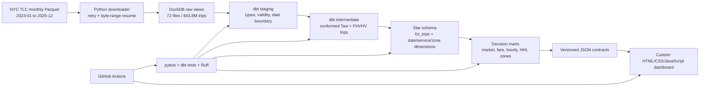
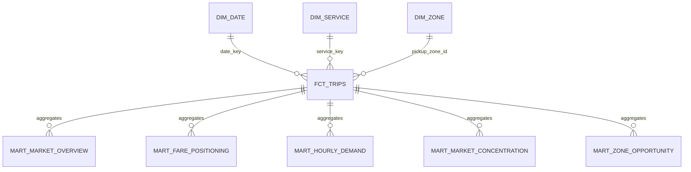

# Green SM NYC Mobility Intelligence

**Tech stack:** Python 3.12 · DuckDB · dbt Core · SQL · HTML/CSS/JavaScript · Chart.js · pytest · Ruff · GitHub Actions  
**Portfolio focus:** Analytics Engineering · Data Analysis · Market Intelligence · Decision Support  
**Author:** Kien Thai  
**License:** [MIT](LICENSE)



My end-to-end analytics project converts **843.8 million official NYC TLC trip records** into market-entry evidence for a hypothetical electric ride-hailing entrant. I designed the project to connect business requirements, dimensional modeling, tested metrics, analytical storytelling, and a custom JavaScript dashboard.

> This is my personal portfolio study. It is not affiliated with Green SM or NYC TLC and does not represent an official market-entry plan.

## Executive summary

NYC is a large mobility market, but completed-trip volume alone is not enough to justify entry. A decision-maker needs to understand competitive concentration, geographic density, operating time windows, fare position, and which signals still require primary research.

This analysis finds that:

- Uber represents **62.23%** of observed completed trips; Uber and Lyft together represent **85.26%**.
- Manhattan contributes **45.95%** of valid completed-trip activity, followed by Brooklyn at **22.75%** and Queens at **19.33%**.
- Annual observed trips increased from **270.3 million in 2023** to **288.9 million in 2025**.
- Operator HHI remains high at **4,504–4,769**, indicating a structurally concentrated observed market.
- The strongest recurring activity windows occur on **Friday and Saturday evenings**, especially 18:00–23:00.
- **Long Island City/Hunters Point**, **LaGuardia Airport**, and **Flushing** lead the latest-year opportunity heuristic, but for different reasons.

The resulting recommendation is not “launch citywide.” It is to advance a **focused discovery phase** around a small number of Queens and Manhattan operating corridors, then validate driver supply, charging, customer acquisition, airport rules, and unit economics before committing fleet capacity.

## 1. Business problem

Green SM is considering a hypothetical entry into New York City's ride-hailing market. The strategic question is:

> Where and when does observed trip activity justify deeper market-entry research, and what evidence is still missing before a fleet decision can be made?

The analysis supports four stakeholders:

| Stakeholder | Decision | Analytical evidence |
|---|---|---|
| Market Strategy | Enter, narrow, or stop the next discovery phase | Market size, growth, operator mix, concentration |
| City Operations | Identify candidate launch zones and shifts | Zone activity, weekday/hour patterns, airport relevance |
| Commercial Analytics | Form an initial pricing hypothesis | Observed fare per trip and paid mile |
| Executive Sponsor | Approve the next investment gate | Evidence summary, limitations, and validation requirements |

The central guardrail is deliberate: **completed trips are observed activity, not total demand or supply**. TLC records do not show rejected requests, unserved passengers, online drivers, idle vehicles, or charging availability.

## 2. What data is required?

### Available evidence

| Dataset | Why it is needed | Fields used |
|---|---|---|
| Yellow Taxi trip records | Establish incumbent street-hail activity and fare observations | Pickup/drop-off time, taxi zones, distance, fare, total |
| High Volume FHV records | Measure app-based operator activity | License, pickup/drop-off time, zones, miles, passenger fare, driver pay |
| TLC taxi-zone lookup | Convert location IDs into business geography | Borough, zone, service zone |

### Evidence still needed before launch

| Missing dataset | Decision it unlocks |
|---|---|
| Requests, cancellations, and ETA | Distinguish completed activity from unmet demand |
| Driver online and idle time | Estimate vehicle utilization and supply coverage |
| Charging locations and dwell time | Test EV operating feasibility by zone and shift |
| Weather, events, and transit disruption | Explain short-term demand variation |
| Acquisition, insurance, labor, and energy costs | Build contribution-margin and payback scenarios |
| Customer research and competitor incentives | Validate willingness to switch and acquisition cost |

This separation prevents descriptive trip records from being presented as a fleet-optimization dataset.

## 3. Data overview

The verified local release uses all official monthly Yellow Taxi and FHVHV files from January 2023 through December 2025.

| Source | Files | Raw rows |
|---|---:|---:|
| Yellow Taxi | 36 Parquet | 128,202,548 |
| High Volume FHV | 36 Parquet | 715,550,152 |
| Taxi-zone lookup | 1 CSV | 265 zones |
| **Trip total** | **72 Parquet** | **843,752,700** |

Quality and date rules retain **839,068,674 valid completed trips** between `2023-01-01` and `2025-12-31`. Raw Parquet occupies approximately 18.36 GB locally and is never committed to Git.

### Preliminary profile

| Signal | Observation | Interpretation |
|---|---:|---|
| App-based FHV share | 85.26% | Entry would compete primarily with entrenched platform networks |
| Manhattan activity share | 45.95% | High density, but likely high competitive and operating pressure |
| 2023 → 2025 activity growth | 6.87% | Observed market activity expanded across the analysis window |
| Average observed fare | $25.07 | Useful positioning reference, not contribution margin |
| Active pickup zones | 263 | Activity is citywide, but opportunity signals are uneven |

Yellow `fare_amount` and FHVHV `base_passenger_fare` are conformed as observed fare. They support directional positioning, not a claim that service pricing structures are identical.

## 4. End-to-end analytical flow



### Dimensional model



Trip identity is a portable hash of service, source basename, and Parquet row number. This avoids a global window sort across 843 million rows while preserving deterministic source-row identity.

## 5. Dashboard storytelling

I built the dashboard as a static analytical product. JavaScript contains no manually entered KPI values: Python exports six versioned JSON contracts directly from tested dbt marts.

### Story 1 — A large but concentrated market

| Operator | Completed trips | Observed share | Average observed fare |
|---|---:|---:|---:|
| Uber | 522.1M | 62.23% | $26.50 |
| Lyft | 193.3M | 23.04% | $24.43 |
| Yellow Taxi | 123.7M | 14.74% | $20.04 |

HHI stays above 4,500 in every analysis year. The decision implication is that a new entrant should not assume market growth automatically produces accessible share. Differentiation, acquisition cost, driver liquidity, and service reliability require explicit validation.

### Story 2 — Geography suggests corridors, not a citywide launch

Manhattan contains almost half of observed activity, but the opportunity heuristic surfaces a more varied shortlist:

| Latest-year zone | Borough | Completed trips | YoY growth | Avg fare | Score |
|---|---|---:|---:|---:|---:|
| Long Island City/Hunters Point | Queens | 2.20M | 9.03% | $24.05 | 80.88 |
| LaGuardia Airport | Queens | 6.16M | 2.49% | $56.85 | 77.90 |
| Flushing | Queens | 1.36M | 10.81% | $23.45 | 76.24 |
| Greenpoint | Brooklyn | 2.46M | 7.06% | $24.64 | 74.77 |
| Financial District North | Manhattan | 1.80M | 4.79% | $35.43 | 73.65 |

Long Island City combines activity, growth, fare, and airport connectivity. LaGuardia ranks highly because every observed pickup is airport-related and fares are high. These are different operating propositions and should not be treated as interchangeable “top zones.”

### Story 3 — Friday and Saturday evenings define the clearest operating window

The largest zone-hour aggregates cluster between 18:00 and 23:00 on Friday and Saturday. This supports a controlled evening-shift experiment, but trip records alone cannot determine how many vehicles are required. Supply availability, turnaround time, charging, deadhead miles, and service-level targets remain scenario inputs.

### Story 4 — The opportunity score organizes research; it does not predict profit

```text
35% activity percentile
+ 30% year-over-year growth percentile
+ 20% observed fare percentile
+ 15% airport relevance percentile
```

All four components remain visible in the dashboard so an analyst can challenge the weights. The score is not profitability, causal market potential, unmet demand, or automated fleet allocation.

## 6. How the dashboard supports decisions

| Evidence | Supported decision | What must happen next |
|---|---|---|
| High activity and growth in selected Queens zones | Prioritize corridor-level discovery | Conduct customer and driver interviews |
| Persistent airport relevance and higher fares | Evaluate an airport-focused proposition | Review permits, queue rules, tolls, and charging turnaround |
| Friday/Saturday evening concentration | Define a limited operating-window pilot | Add driver supply and vehicle-cycle assumptions |
| High operator concentration | Avoid undifferentiated citywide entry | Quantify acquisition incentives and retention costs |
| Manhattan activity density | Retain Manhattan as a benchmark market | Compare congestion, deadhead, and insurance economics |

### Decision recommendation

Advance to a **narrow validation stage**, not a fleet commitment:

1. Compare Long Island City–Manhattan and LaGuardia-oriented operating scenarios.
2. Acquire request, supply, charging, and cost inputs.
3. Define service-level, utilization, and contribution-margin thresholds.
4. Run a time-bounded pilot only if those thresholds are credible.

## 7. Data quality and validation

The full-data local run passed **61/61 scale-appropriate dbt nodes**. Deterministic CI additionally runs trip-key global uniqueness checks on compact generated fixtures.

Controls include:

- source typing, accepted values, and valid date boundaries;
- non-null and relationship tests;
- fact-to-conformed row reconciliation;
- weighted-fare numerator/denominator reconciliation;
- market-share totals;
- mart-grain uniqueness;
- opportunity-score bounds;
- dashboard JSON contracts and static asset tests;
- Python linting, formatting, and JavaScript syntax checks.

See [Real Data Validation](docs/REAL_DATA_VALIDATION.md), [Metric Contracts](docs/METRICS.md), and [Release Review](docs/REVIEW.md).

## 8. Run the project

### View the current real-data dashboard

```powershell
cd E:\green-sm-nyc-mobility-intelligence
python -m http.server 8000 -d dashboard
```

Open `http://localhost:8000`. Do not use `file://`; browsers block the JSON requests.

### Rebuild from existing real TLC files

```powershell
uv sync --frozen --all-groups
uv run python scripts/run_pipeline.py `
  --mode local `
  --manifest artifacts/real-2023-2025.json
```

### Run quality checks

```powershell
uv run pytest
uv run ruff check .
uv run ruff format --check .
node --check dashboard/app.js
```

The verified local full-data build takes approximately 25 minutes with a 2 GB DuckDB memory limit. CI uses deterministic fixtures rather than downloading 18+ GB on every commit. GitHub Pages deploys the committed aggregate real-data snapshot from `dashboard/data/`.

## 9. Repository structure

```text
green-sm-nyc-mobility-intelligence/
|-- .github/
|   `-- workflows/
|       |-- ci.yml                         # Build, lint, test, evidence, metadata commit
|       `-- pages.yml                      # Validate and deploy dashboard to GitHub Pages
|-- dashboard/
|   |-- data/                              # Published aggregate real-data contracts
|   |   |-- fares.json
|   |   |-- hourly.json
|   |   |-- market.json
|   |   |-- metadata.json
|   |   |-- summary.json
|   |   `-- zones.json
|   |-- app.js                             # Fetch, filter, charts, table, and heatmap logic
|   |-- index.html                         # Dashboard semantic structure
|   |-- styles.css                         # Responsive visual system
|   `-- README.md                          # Dashboard serving notes
|-- data/
|   |-- raw/tlc/                           # Local-only official TLC files (Git ignored)
|   |   |-- yellow/                        # 36 monthly Parquet files, 2023-2025
|   |   |-- fhvhv/                         # 36 monthly Parquet files, 2023-2025
|   |   `-- taxi_zone_lookup.csv
|   |-- sample/                            # CI fixtures generated on demand
|   |   `-- .gitkeep
|   |-- warehouse/                         # Local DuckDB database (Git ignored)
|   `-- README.md                          # Data directory contract
|-- dbt/
|   |-- macros/
|   |   `-- generate_schema_name.sql       # Stable custom schema naming
|   |-- models/
|   |   |-- staging/
|   |   |   |-- _sources.yml
|   |   |   |-- _staging__models.yml
|   |   |   |-- stg_tlc__fhvhv_trips.sql
|   |   |   |-- stg_tlc__pipeline_metadata.sql
|   |   |   |-- stg_tlc__taxi_zones.sql
|   |   |   `-- stg_tlc__yellow_trips.sql
|   |   |-- intermediate/
|   |   |   |-- _intermediate__models.yml
|   |   |   |-- int_trips_conformed.sql
|   |   |   `-- int_zone_yearly_metrics.sql
|   |   `-- marts/
|   |       |-- _marts__models.yml
|   |       |-- core/
|   |       |   |-- dim_date.sql
|   |       |   |-- dim_service.sql
|   |       |   |-- dim_zone.sql
|   |       |   `-- fct_trips.sql
|   |       `-- analytics/
|   |           |-- mart_fare_positioning.sql
|   |           |-- mart_hourly_demand.sql
|   |           |-- mart_market_concentration.sql
|   |           |-- mart_market_overview.sql
|   |           `-- mart_zone_opportunity.sql
|   |-- tests/
|   |   |-- assert_fact_preserves_conformed_trip_count.sql
|   |   |-- assert_market_fare_components_reconcile.sql
|   |   |-- assert_market_shares_sum_to_one.sql
|   |   |-- assert_opportunity_scores_are_bounded.sql
|   |   `-- assert_weighted_fare_metrics_are_non_negative.sql
|   |-- dbt_project.yml
|   `-- profiles.yml
|-- docs/
|   |-- adr/
|   |   |-- 0001-local-analytics-stack.md
|   |   |-- 0002-static-javascript-dashboard.md
|   |   `-- 0003-observed-facts-not-supply.md
|   |-- assets/
|   |   `-- dashboard-overview.png
|   |-- ARCHITECTURE.md
|   |-- BRD.md
|   |-- DATA_MODEL.md
|   |-- DATA_SOURCES.md
|   |-- METRICS.md
|   |-- MILESTONES.md
|   |-- PUBLISHING.md
|   |-- REAL_DATA_VALIDATION.md
|   |-- REVIEW.md
|   `-- RUNBOOK.md
|-- scripts/
|   |-- clean.py                            # Remove reproducible local build artifacts
|   `-- run_pipeline.py                     # Source-to-dashboard orchestration
|-- src/
|   `-- green_sm_nyc/
|       |-- __init__.py
|       |-- cli.py                          # Project command-line interface
|       |-- config.py                       # Repository-relative path configuration
|       |-- dashboard_export.py             # Marts-to-JSON serving contracts
|       |-- sample_data.py                  # Deterministic CI fixture generator
|       |-- tlc.py                          # Official TLC downloader with resume
|       `-- warehouse.py                    # Idempotent DuckDB raw loader
|-- tests/
|   |-- test_dashboard_contract.py
|   |-- test_dashboard_static.py
|   |-- test_sample_data.py
|   |-- test_tlc.py
|   |-- test_warehouse.py
|   `-- test_warehouse_relation_types.py
|-- .gitattributes
|-- .gitignore
|-- .pre-commit-config.yaml
|-- .python-version
|-- CONTRIBUTING.md
|-- LICENSE
|-- Makefile
|-- pyproject.toml
|-- README.md
`-- uv.lock
```

Generated caches, dbt artifacts, raw data, DuckDB files, and run manifests are excluded from Git. The six aggregated JSON contracts under `dashboard/data/` are committed to serve the public dashboard; they contain no trip-level records. Sample CSVs are generated on demand and are not repository source files.

## 10. Limitations

- TLC exposes completed trips, not all requests or available supply.
- Operator identity is inferred from TLC high-volume license codes.
- Fare measures are descriptive and exclude complete cost economics.
- The zone score is sensitive to chosen percentile weights.
- Static JSON supports analytical exploration but not trip-level drill-through.
- Weather, events, charging, incentives, and customer behavior are not yet modeled.

## Conclusion

The data supports a disciplined next step: investigate a small set of high-signal corridors and evening operating windows, while treating concentration and missing supply economics as major entry risks. It does **not** support an immediate citywide fleet deployment.

From a portfolio perspective, the project demonstrates how an Analytics Engineer and Data Analyst can move from an ambiguous strategy question to governed metrics, a scalable local model, tested marts, transparent analysis, and an interactive decision product—without overstating what the available data can prove.

## Author, data, and license

I am **Kien Thai**, and I built this project as a personal Analytics Engineering and Data Analysis portfolio case study.

Project code is released under the [MIT License](LICENSE). Official NYC TLC trip-level data remains subject to the source provider's terms and is not redistributed in this repository. See [Data Sources and Licensing](docs/DATA_SOURCES.md) and [Publishing to GitHub](docs/PUBLISHING.md).
