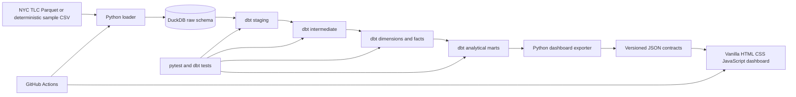

# Architecture

## Design goals

The architecture favors analytical correctness, portability, and portfolio reproducibility over platform complexity. It is designed for an Analytics Engineer / Data Analyst working locally and publishing a static analytical product.

## Components

| Layer | Technology | Responsibility |
|---|---|---|
| Source | NYC TLC files / generated fixtures | Completed trip observations and taxi-zone reference data. |
| Load | Python | Validate file presence and replace raw DuckDB tables idempotently. |
| Warehouse | DuckDB | Local analytical storage and SQL execution. |
| Transform | dbt Core + dbt-duckdb | Build documented and tested staging, intermediate, dimensions, facts, and marts. |
| Serving contract | Python JSON export | Convert mart output into stable browser-readable datasets. |
| Presentation | HTML/CSS/JavaScript + Chart.js | Interactive analytical narrative without a backend. |
| Automation | GitHub Actions | Lint, test, build sample data, validate dashboard contracts, and deploy static files. |

## Data cadence

- Portfolio/sample mode: rebuilt on every CI run.
- Full-data mode: monthly after TLC publishes a new file.
- Dashboard freshness: inherited from the latest mart pickup month and shown in the UI.

## Environments

- `sample`: deterministic generated inputs, fast enough for CI.
- `local`: user-provided official TLC Parquet files.
- Static deployment: generated `dashboard/` directory only; no warehouse or raw data is published.

## Security and governance

- TLC public trip records contain no passenger identity in this project.
- Raw files, DuckDB databases, logs, and temporary artifacts are git-ignored.
- Dashboard data is aggregated to zone/time/service levels.
- Metric definitions are version controlled in dbt and `docs/METRICS.md`.

## Scalability boundary

DuckDB is appropriate for local analytical development and a portfolio project. The marts and dbt contracts are intentionally portable; a future migration can replace DuckDB with BigQuery or Snowflake without changing the dashboard contract.

## Known limitations

- Completed trips do not expose rejected requests or available vehicles.
- Static deployment does not provide row-level drill-through.
- The sample dataset proves correctness and reproducibility, not real NYC findings.

