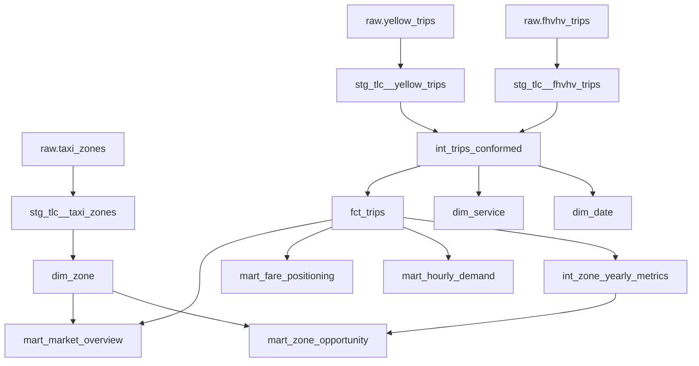

# Data Model

## Modeling principles

- A model documents its grain before its columns.
- Staging models rename, cast, and validate one raw source only.
- Intermediate models conform services and calculate reusable analytical fields.
- Facts and dimensions expose stable business entities.
- Marts answer one defined analytical decision.

## Lineage



## Model grains

| Model | Grain | Key |
|---|---|---|
| `stg_tlc__yellow_trips` | One observed Yellow Taxi completed trip | `trip_id` |
| `stg_tlc__fhvhv_trips` | One observed high-volume FHV completed trip | `trip_id` |
| `int_trips_conformed` | One completed trip across supported services | `trip_id` |
| `int_zone_yearly_metrics` | One pickup zone and calendar year | `zone_id`, `pickup_year` |
| `dim_zone` | One TLC taxi zone | `zone_id` |
| `dim_service` | One service/operator combination | `service_key` |
| `dim_date` | One calendar date | `date_key` |
| `fct_trips` | One completed trip | `trip_id` |
| `mart_market_overview` | One month × pickup borough × operator | `market_grain_key` |
| `mart_fare_positioning` | One month × operator | `fare_grain_key` |
| `mart_hourly_demand` | One pickup zone × weekday × hour | `demand_grain_key` |
| `mart_market_concentration` | One calendar year | `pickup_year` |
| `mart_zone_opportunity` | One zone in the latest analysis year | `zone_id` |

## Zone Opportunity Score

The score is a ranking heuristic on a 0–100 scale:

```text
35% recent completed-trip activity percentile
30% year-over-year completed-trip growth percentile
20% average observed fare percentile
15% airport-trip share percentile
```

Missing growth is neutralized at zero before ranking. Each component remains visible so analysts can challenge the weights. The score must never be described as profit, demand-supply gap, or causal market potential.
